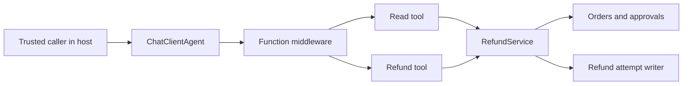

# ContextWindow.AI.AgentPermissions

A fictional refund agent offers a read tool and a write tool. Microsoft Agent Framework function invocation middleware checks proposed calls before they reach a tool; the service independently enforces the authoritative rule for direct callers too. All identities and records are scripted local fixtures.



Requires .NET 10 SDK. Pinned packages: Microsoft.Agents.AI 1.22.0, xUnit 2.9.3 and Microsoft.NET.Test.Sdk 17.14.1. No API keys, real model or database are required.

```bash
dotnet restore tests/ContextWindow.AI.AgentPermissions.Tests/ContextWindow.AI.AgentPermissions.Tests.csproj
dotnet build tests/ContextWindow.AI.AgentPermissions.Tests/ContextWindow.AI.AgentPermissions.Tests.csproj --configuration Release
dotnet test tests/ContextWindow.AI.AgentPermissions.Tests/ContextWindow.AI.AgentPermissions.Tests.csproj --configuration Release
dotnet pack src/ContextWindow.AI.AgentPermissions/ContextWindow.AI.AgentPermissions.csproj --configuration Release
```

An example compiled into the tests is in `examples/RefundUsage.cs`:

```csharp
Caller caller = new("ana", "green");
Order order = await service.ReadOrderAsync(caller, "G-217", cancellationToken);
```

Green's G-217 is readable by Ana; Blue's B-104 is not. The allowed write is 4200 USD minor units. Approval binds tenant, actor, operation, order, amount and currency. Expiry is exclusive and revocation takes effect at the next check. The fixture's local writer counts attempts and its local state is not evidence of settlement. A separate durable operation identifier, duplicate protection and reconciliation are needed for unknown payment outcomes. The fixture does not establish general prompt-injection resistance.

The middleware pattern follows Microsoft Learn's Agent Framework function-calling middleware documentation. Access rules, identity capture and approval storage are application logic, not framework features.

License: MIT.
